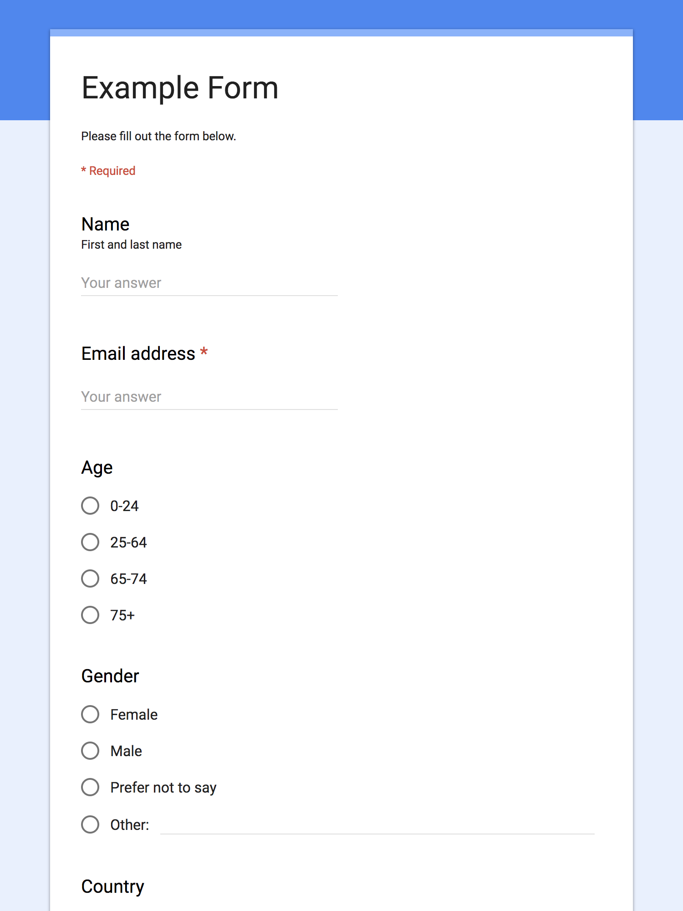
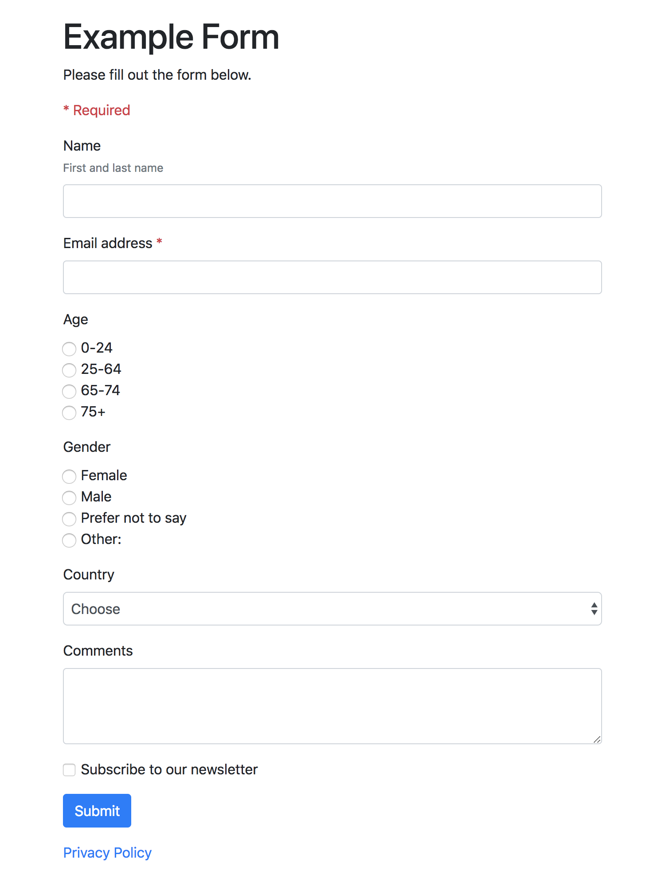

# google-forms-css
Style Google Forms with Bootstrap or CSS

## About
This library let's you embed a Google Form in a web page and style it with Bootstrap or CSS.

There are a [number of tutorials](https://www.google.com/search?q=google+forms+css) on the web that show you how to code your own HTML form and link it to a Google Form. This library does it for you.

| Google Forms                             | google-forms-css                         |
|:----------------------------------------:|:----------------------------------------:|
|          |            |

Demo: [Google Forms](https://docs.google.com/forms/d/e/1FAIpQLSeMO__7rzu_gS8Yurq9ai3z99rQeS0xe_rzkzYa7vYdu4Ea8g/viewform) | [google-forms-css](https://jgrant.me/google-forms-css/example.html)

What works:

* These questions:
  * *Short answer* (text)
  * *Paragraph* (textarea)
  * *Multiple choice* (radio buttons)
  * *Checkboxes*
  * *Dropdown* (select)
  * *Date*
  * *Time*
* Email address validation
* *Other…* option
* *Required* option
* *Title and description* block

What doesn't work:

* Anything that requires Google sign in (*Collect email addresses*\*, *Restrict to Organization users*, etc.)
* These questions:
  * *File upload*
  * *Linear scale*
  * *Multiple choice grid*
  * *Checkbox grid*
* *Image*, *video* and *section* blocks
* Quizzes

\*You can still collect email addresses, you just need to uncheck *Settings* > *Collect email addresses* and add your own email address question.


## Requirements
* A web server that supports PHP (to bypass [CORS](https://en.wikipedia.org/wiki/Cross-origin_resource_sharing) restrictions)
* jQuery
* Bootstrap (optional, but really tasty!)


## Instructions
1. Create a new Google Form

  * If you're using G Suite, uncheck *Settings* > *Restrict to Organization users*
  * Don't use anything that requires Google sign in
  * Preview the form and make a note of the URL (e.g. https://docs.google.com/forms/d/e/qwerty/viewform)


2. Upload the `google-forms-css` folder to your web server

3. Include jQuery in the `<head>` of your page (if it isn't already):

  ```
  <script src="//cdnjs.cloudflare.com/ajax/libs/jquery/3.3.1/jquery.min.js"></script>
  ```

4. Include Bootstrap in the `<head>` of your page (if it isn't already):

  ```
  <link href="//stackpath.bootstrapcdn.com/bootstrap/4.1.1/css/bootstrap.min.css" rel="stylesheet">
  ```

  Tip: You can use [Isolated Bootstrap](https://github.com/toert/Isolated-Bootstrap) instead if you only want to style the form, not your entire page:

  ```
  <link href="//toert.github.io/Isolated-Bootstrap/versions/4.1.0/iso_bootstrap4.1.0min.css" rel="stylesheet">
  ```

  Alternatively, you can skip Bootstrap and style the form yourself by targeting [Bootstrap class names](https://getbootstrap.com/docs/4.1/components/forms/) with CSS.

5. Add this code in the `<body>` of your page, replacing the `formURL` with your own:

  ```
  <div class="bootstrap" id="google-forms-css">

    <!-- loading -->
    <div id="google-forms-css-loading">
      <p>Loading…</p>
    </div>

    <div id="google-forms-css-main" style="display: none;">

      <!-- header -->
      <p>Please fill out the form below.</p>
      <p class="text-danger">* Required</p>

      <form id="google-forms-css-form"></form>

      <!-- footer -->
      <p><a href="privacy-policy.html">Privacy Policy</a></p>

    </div>

    <!-- confirmation -->
    <div id="google-forms-css-confirmation" style="display: none;">
      <p>Thanks!</p>
    </div>

  </div>

  <script src="google-forms-css/google-forms-css.js"></script>
  <script>

  new googleFormsCSS({
    formURL: 'https://docs.google.com/forms/d/e/1FAIpQLSeMO__7rzu_gS8Yurq9ai3z99rQeS0xe_rzkzYa7vYdu4Ea8g/viewform',
    // confirmationURL: 'confirmation.html', // optional
    // placeholderText: 'Your answer', // optional
  });

  </script>
  ```

6. Give it a whirl!


## Tips
- You can modify the loading, header, footer and confirmation elements.

- Pass an optional `confirmationURL` to redirect the browser after submission.

- Pass an optional `placeholderText` to add placeholder text to input fields.


## Feedback

Feedback and suggestions welcome!
